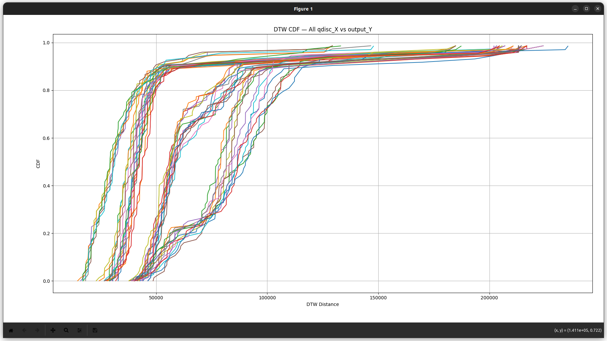
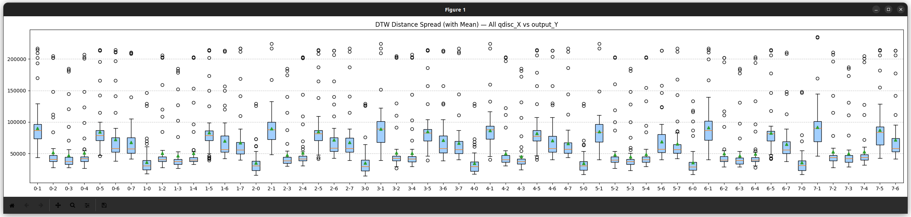
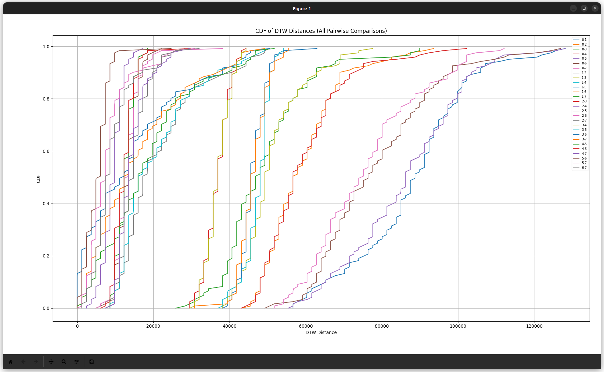
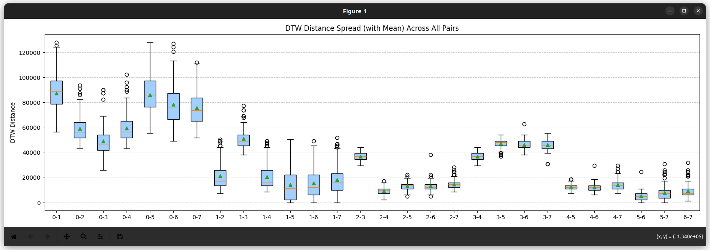
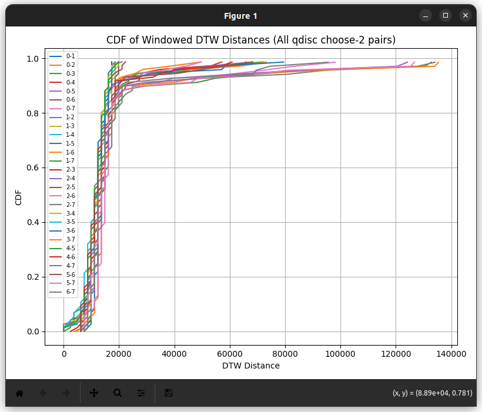
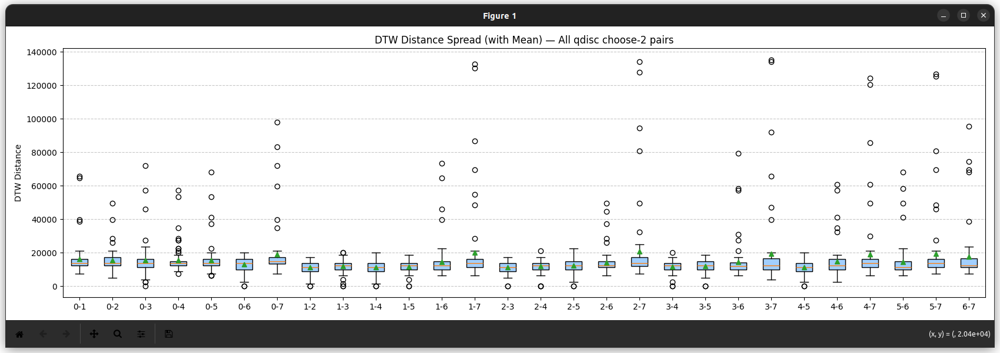

# Comparing DTW difference distributions between mahimahi/mahimahi, linux kernel/linux kernel, mahimahi/linux kernel

> **Note:** Mahimahi traces show significantly higher variability in DTW (Dynamic Time Warping) distances between queue size time series. This suggests greater fluctuations in the number of packets in the queue across runs.  
>  
> In contrast, Linux kernel (`qdisc`) traces exhibit much lower DTW distances, indicating more consistent and stable queue behavior.  
>  
> This implies that Mahimahi simulates more bursty or variable queuing dynamics, whereas the Linux kernel enforces more deterministic queuing patterns.

> **Note:** This is a simple comparative study based on 7 Mahimahi traces and 7 Linux kernel (`qdisc`) traces.

> **Note:** We use Dynamic Time Warping (DTW) because of timing misalignments between trace sources. While both Mahimahi and Linux kernel AQM tools (like DualPI2 in tc) rely on kernel-level mechanisms, Mahimahi's emulation and logging involve user-space components. These user-space processes are more vulnerable to context switches and timer inaccuracies, which can perturb timestamp regularity. In addition, when using Bash scripts to listen with tcpdump, sleep-based logging intervals (e.g., using sleep or timeout) are subject to scheduling delays and context switches, DTW helps account for such temporal distortions by aligning sequences based on structural similarity, not fixed time steps.

## mahimahi / linux kernel

### mahimahi / mahimahi

### linux kernel / linux kernel

