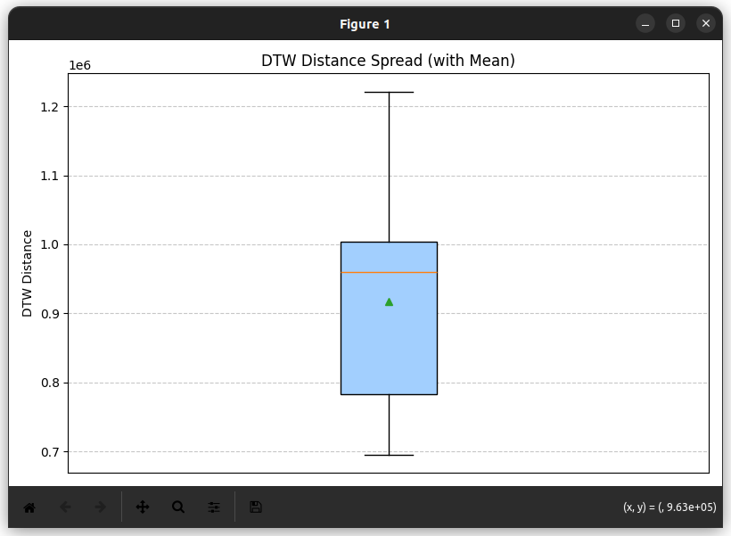

# Comparing DTW difference distributions between mahimahi/mahimahi, linux kernel/linux kernel, mahimahi/linux kernel

> **Note:** Mahimahi traces show significantly higher variability in DTW (Dynamic Time Warping) distances between queue size time series. This suggests greater fluctuations in the number of packets in the queue across runs.  
>  
> In contrast, Linux kernel (`qdisc`) traces exhibit much lower DTW distances, indicating more consistent and stable queue behavior.  
>  
> This implies that Mahimahi simulates more bursty or variable queuing dynamics, whereas the Linux kernel enforces more deterministic queuing patterns.

> **Note:** This is a simple comparative study based on 7 Mahimahi traces and 7 Linux kernel (`qdisc`) traces.

## mahimahi / linux kernel

### mahimahi / mahimahi

### linux kernel / linux kernel

